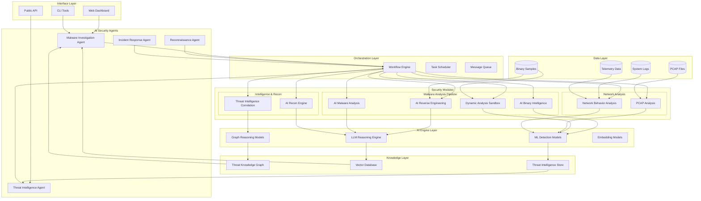

# M0ST - Architecture

## High-Level System Design



---

## AI Reverse Engineering Module — Detailed Architecture

The AI Reverse Engineering module implements the **7-layer M0ST architecture** for binary analysis:

### End-to-End Data Flow

```
Binary → RE Module → PKG → AI-Assisted Binary Analysis → Security Insights
```

```
 ┌─────────────────────────────────────────────────────────────────────────┐
 │  1. INTERFACE LAYER                                                     │
 │     CLI (ui/cli.py)  ·  API Server (FastAPI)  ·  Command Handlers      │
 └────────────────────────────────┬────────────────────────────────────────┘
                                  │
 ┌────────────────────────────────▼────────────────────────────────────────┐
 │  2. AI SECURITY AGENTS LAYER                                            │
 │     StaticAgent · GraphAgent · LLMAgent · PseudocodeAgent               │
 │     DynamicAgent · VerifierAgent · Z3Agent · SemanticAgent              │
 │     HeuristicsAgent · StaticPost · LLMSemanticAgent                    │
 └────────────────────────────────┬────────────────────────────────────────┘
                                  │
 ┌────────────────────────────────▼────────────────────────────────────────┐
 │  3. ORCHESTRATION LAYER                                                 │
 │     MasterAgent — pipeline controller (classical + AI)                  │
 │     PlannerAgent — 10-stage intelligent pipeline with decision logic    │
 └────────────────────────────────┬────────────────────────────────────────┘
                                  │
 ┌────────────────────────────────▼────────────────────────────────────────┐
 │  4. SECURITY MODULES LAYER                                              │
 │     ┌─ Reverse Engineering ──────────────┐  ┌─ AI-Assisted Analysis ─┐ │
 │     │  Disassembly (r2pipe)              │  │  VulnerabilityDetector │ │
 │     │  CFG Recovery                      │  │  MalwareClassifier     │ │
 │     │  Pseudocode Generation (Ghidra/r2) │  └────────────────────────┘ │
 │     │  Type Inference                    │                              │
 │     │  Deobfuscation Engine              │                              │
 │     └────────────────────────────────────┘                              │
 └────────────────────────────────┬────────────────────────────────────────┘
                                  │
 ┌────────────────────────────────▼────────────────────────────────────────┐
 │  5. AI ENGINE LAYER                                                     │
 │     GNN Models (GAT, GraphSAGE, GINE)   ·  Binary Embedding Engine    │
 │     LLM Inference (OpenAI/Anthropic/Mistral/Local)                     │
 │     Symbol Recovery Engine  ·  Training Manager                        │
 └────────────────────────────────┬────────────────────────────────────────┘
                                  │
 ┌────────────────────────────────▼────────────────────────────────────────┐
 │  6. KNOWLEDGE LAYER                                                     │
 │     Program Knowledge Graph (PKG)  ·  Embedding Store                  │
 │     Symbol Database  ·  Semantic Index                                 │
 └────────────────────────────────┬────────────────────────────────────────┘
                                  │
 ┌────────────────────────────────▼────────────────────────────────────────┐
 │  7. DATA LAYER                                                          │
 │     Binary Repository  ·  Analysis Result Store  ·  Dataset Pipeline   │
 └─────────────────────────────────────────────────────────────────────────┘
```

---

### Layer 1 — Interface

| Component        | Location                       | Purpose                                    |
| ---------------- | ------------------------------ | ------------------------------------------ |
| CLI              | `interface/cli/` → `ui/cli.py` | Interactive REPL with all command handlers |
| API Server       | `interface/api/`               | FastAPI REST endpoints (health, functions) |
| Command Handlers | `interface/commands/`          | Decoupled command dispatch                 |

### Layer 2 — AI Security Agents

11 agents under `ai_security_agents/`:

| Agent              | Purpose                                          |
| ------------------ | ------------------------------------------------ |
| `StaticAgent`      | radare2 disassembly, CFG extraction              |
| `GraphAgent`       | GNN-based structural analysis, embeddings        |
| `LLMAgent`         | LLM API wrapper (multi-provider)                 |
| `PseudocodeAgent`  | Ghidra/r2 decompilation + normalization          |
| `LLMSemanticAgent` | AI-powered semantic reasoning pipeline           |
| `DynamicAgent`     | GDB-based runtime tracing                        |
| `VerifierAgent`    | Safety checks + Z3 integration                   |
| `Z3Agent`          | Symbolic constraint solving                      |
| `SemanticAgent`    | Rule-based behavior explanation                  |
| `HeuristicsAgent`  | Classical pattern matching (loops, crypto, etc.) |
| `StaticPost`       | CFG cleanup: chain folding, unreachable removal  |

### Layer 3 — Orchestration

- **MasterAgent** (`orchestration/master_agent.py`) — Pipeline controller (classical + AI modes)
- **PlannerAgent** (`orchestration/planner_agent.py`) — 10-stage intelligent pipeline with conditional agent invocation

### Layer 4 — Security Modules

**Reverse Engineering** (`security_modules/reverse_engineering/`): Disassembly, CFG recovery, pseudocode generation, type inference, deobfuscation (control-flow flattening, opaque predicates, junk code, packers, VM-based obfuscation).

**AI-Assisted Binary Analysis** (`security_modules/ai_assisted_binary_analysis/`): Vulnerability detection (unsafe calls, stack overflow, format strings, UAF, integer overflow) and malware classification (suspicious API categorization, risk scoring 0.0–1.0).

### Layer 5 — AI Engine

GNN models (GAT/GraphSAGE/GINE), binary embedding engine (CFG → embedding → similarity search), LLM inference (OpenAI/Anthropic/Mistral/Ollama), symbol recovery (3-stage: heuristic → embedding → LLM), training manager.

### Layer 6 — Knowledge

**Program Knowledge Graph (PKG)** — Functions, blocks, instructions, variables, structs, edges (CALL, CFG_FLOW, DATA_FLOW, TYPE_RELATION), annotations, dynamic traces. Embedding store, symbol database, semantic index.

### Layer 7 — Data

Binary repository (SHA-256 tracking), analysis result store (keyed by binary + type), dataset pipeline (function embeddings, vulnerability labels, symbol ground truth, deobfuscation pairs).

---

### Capability System

Each agent declares `CAPABILITIES` (a set of `Capability` enum values). The orchestrator checks with `enforce_capability()` before invoking agent methods.

| Capability        | Agents                                                                        |
| ----------------- | ----------------------------------------------------------------------------- |
| `STATIC_WRITE`    | StaticAgent                                                                   |
| `STATIC_READ`     | HeuristicsAgent, SemanticAgent, GraphAgent, PseudocodeAgent, LLMSemanticAgent |
| `DYNAMIC_EXECUTE` | DynamicAgent                                                                  |
| `VERIFY`          | VerifierAgent, Z3Agent                                                        |
| `SEMANTIC_REASON` | SemanticAgent, LLMAgent, LLMSemanticAgent                                     |
| `LLM_INFERENCE`   | LLMAgent                                                                      |
| `GNN_INFERENCE`   | GraphAgent                                                                    |
| `PSEUDOCODE`      | PseudocodeAgent                                                               |
| `PLANNING`        | PlannerAgent                                                                  |
| `PLUGIN_ANALYSIS` | PluginManager                                                                 |
| `SNAPSHOT`        | SnapshotManager                                                               |

---

### Directory Structure

```
M0ST/
├── main.py                          # Entry point
├── config.yml                       # Configuration
├── requirements.txt                 # Python dependencies
│
├── interface/                       # Layer 1: Interface
│   ├── cli/                         #   CLI re-export
│   ├── api/                         #   FastAPI server
│   └── commands/                    #   Command handlers
│
├── ai_security_agents/              # Layer 2: AI Security Agents
│   ├── static_agent.py              #   ... (11 agents)
│   └── ...
│
├── orchestration/                   # Layer 3: Orchestration
│   ├── master_agent.py
│   └── planner_agent.py
│
├── security_modules/                # Layer 4: Security Modules
│   ├── reverse_engineering/
│   │   ├── disassembly/
│   │   ├── cfg_recovery/
│   │   ├── pseudocode/
│   │   ├── type_inference/
│   │   └── deobfuscation/
│   └── ai_assisted_binary_analysis/
│       ├── vulnerability_detection.py
│       └── malware_classification.py
│
├── ai_engine/                       # Layer 5: AI Engine
│   ├── gnn_models/
│   ├── embedding_models/
│   ├── llm_inference/
│   ├── symbol_recovery/
│   └── training/
│
├── knowledge/                       # Layer 6: Knowledge
│   ├── program_graph/               #   PKG
│   ├── embeddings/
│   ├── symbol_database/
│   └── semantic_index/
│
├── data/                            # Layer 7: Data
│   ├── binaries/
│   ├── analysis_results/
│   └── datasets/
│
├── core/                            # Config, capabilities, events, IR
├── storage/                         # Graph store, SQLite, snapshots
├── plugins/                         # Dynamic analysis plugins
├── analysis/                        # Constraint passes, complexity
├── ui/                              # CLI implementation
├── tests/                           # Test suite
└── docker/                          # Container configuration
```
